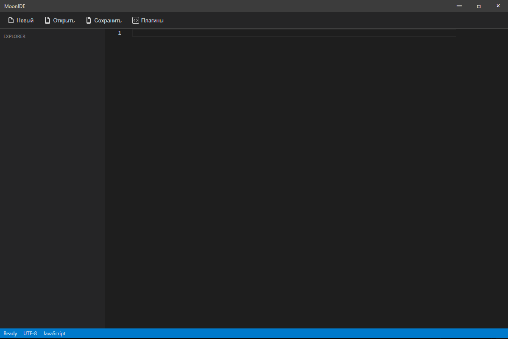

# MoonIDE

A modern, lightweight code editor built with Electron and Monaco Editor. MoonIDE combines the power of VS Code's editor with a clean, minimal interface.



## Features

- 🚀 **Fast and Lightweight**: Built with Electron for optimal performance
- 🎨 **Modern UI**: Clean and intuitive interface
- 📝 **Monaco Editor**: The same editor that powers VS Code
- 🔌 **Plugin System**: Extend functionality with language support plugins
- 🎯 **Multiple Language Support**: JavaScript, TypeScript, Python, C/C++, C#, Java, PHP, and more
- 💾 **File Management**: Easy file operations with a familiar interface
- 🎨 **Customizable**: Dark theme by default with more themes coming soon

## Installation

1. Clone the repository:
```bash
git clone https://github.com/yourusername/moonide.git
cd moonide
```

2. Install dependencies:
```bash
npm install
```

3. Start the application:
```bash
npm start
```

## Development

### Prerequisites

- Node.js (v14 or higher)
- npm (v6 or higher)

### Building from Source

1. Install dependencies:
```bash
npm install
```

2. Compile SCSS:
```bash
npm run sass
```

3. Start the development server:
```bash
npm start
```

### Available Scripts

- `npm start` - Start the application
- `npm run sass` - Watch and compile SCSS files
- `npm run build` - Build the application for production
- `npm run package` - Package the application for distribution

## Plugin System

MoonIDE features a plugin system that allows you to add support for different programming languages and tools. Available plugins include:

- C/C++
- C#
- Python
- Java
- TypeScript
- PHP

To install plugins:
1. Click the "Plugins" button in the menu bar
2. Browse available plugins
3. Click "Install" on the desired plugin

## Contributing

Contributions are welcome! Please feel free to submit a Pull Request. For major changes, please open an issue first to discuss what you would like to change.

1. Fork the repository
2. Create your feature branch (`git checkout -b feature/AmazingFeature`)
3. Commit your changes (`git commit -m 'Add some AmazingFeature'`)
4. Push to the branch (`git push origin feature/AmazingFeature`)
5. Open a Pull Request

## License

This project is licensed under the MIT License - see the [LICENSE](LICENSE) file for details.

## Acknowledgments

- [Electron](https://www.electronjs.org/)
- [Monaco Editor](https://microsoft.github.io/monaco-editor/)
- [VS Code](https://code.visualstudio.com/)

## Contact

Your Name - [@yourtwitter](https://twitter.com/yourtwitter)

Project Link: [https://github.com/yourusername/moonide](https://github.com/yourusername/moonide) 